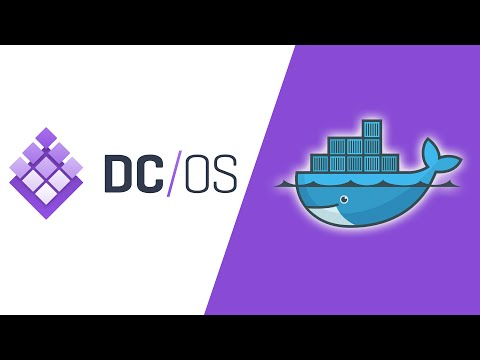

DC/OS Instavote
=========

Run a simple voting app with docker containers on DC/OS through Marathon

Getting started
---------------

Set a cluster with DC/OS running. Home page at [DC/OS home page](https://dcos.io/).
If you are using Amazon EC2 (container service) you can use the cloudformation included in the project.

Through Marathon launch every JSON file app. The app will be running on port 8080 for voting and 8081 for results. Or on ports 80 for voting and 8080 for results if you use the cloudformation. 

Architecture
-----

* A Python webapp which lets you vote between two options
* A Redis queue which collects new votes
* A .NET worker which consumes votes and stores them in Postgres database
* A Postgres database backed by a Docker volume
* A Node.js webapp which shows the results of the voting in real time
* A load balancer (haproxy)

Ps: The code contains Google Analytics code for both voting app and result app. If you plan to use it make sure to remove both <head> and <body> code
